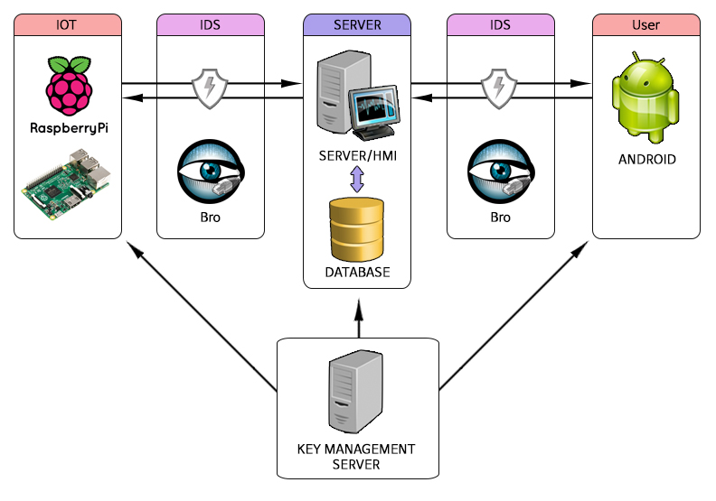

# 본 프로젝트는 라즈베리파이를 이용한 사물인터넷 보안 테스트 플랫폼으로 계속 수정중에 있습니다.


## 프로젝트소개 
본 프로젝트는 사물인터넷의 보안테스트 플랫폼으로 라즈베리파이 - 윈도우서버 - 안드로이드 애플리케이션간 TCP/IP 소켓통신 형태로 구성됩니다.
여기에 추가로 Bro를 이용한 IDS, AES키 관리서버를 구성합니다.
TCP/IP 소켓통신간 데이터와 데이터베이스의 AES암호화, Bro를 이용한 IDS 구현, RSA암호화를 이용한 AES키 관리가 가능합니다.
<br>

## 설치/실행환경 
TCP/IP 소켓통신은 무선인터넷환경에서 진행되었습니다.
본 프로젝트의 데이터베이스는 Mysql을 사용하였기때문에 다른 데이터베이스 가이드는 제공하지않습니다.
### 라즈베리파이 
* 본 테스트플랫폼에서는 라즈베리파이 3 Model B V1.2를 사용합니다.
	* 하위 버전의 라즈베리파이2,B+ 버전 사용시 무선랜설정을 따로 진행하셔야 합니다.
* [라즈베리파이 하드웨어 구성](https://www.raspberrypi.org/learning/hardware-guide/equipment/)
  * 라즈베리파이 하드웨어 구성은 위 링크를 참조하시기 바랍니다.
* [라즈비안 설치 방법](https://www.raspberrypi.org/learning/software-guide/quickstart/)
  * 라즈비안 설치 방법은 위 링크를 참조하시기 바랍니다.
  * 라즈비안은 [Raspbian-jessie 버전](https://www.raspberrypi.org/downloads/raspbian/)을 사용하였습니다.
* 사용된 코드는 c언어로 작성되었습니다.
* 통신시 전송하는 데이터는 임의로 사용하였습니다.

#### 라즈베리파이 초기 설정
* 라즈베리파이3 기준의 초기 설정입니다.
* 라즈비안 부팅후 터미널을 실행 하여 다음 명령어를 입력합니다. 
	```  
	sudo raspi-config
	```  
	* 7번 Advanced Option으로 들어가서 A1 Expand Filesystem 실행 합니다. 이는 사용자가 라즈비안을 설치한 저장소 전체를 사용할 수 있도록 해줍니다. 
	* 4번 Localisation Options으로 들어가서 T1~4의 과정을 진행 합니다.
		* T1 Change Locale은 언어 세팅 입니다. 다음의 언어팩을 찾아 추가 해주시기 바랍니다.
		```
		en_US.UTF-8  
		ko_KR.UTF-8
		```
		* T2 Change Timezone은 시간 설정입니다. Asia-Seoul로 맟춰 줍니다.(외국의 경우 거주하는 국가에 맟춰 설정하시면 됩니다.)
		* T3 Change Keyboard Layout은 키보드 설정입니다. 기본적인 특수문자 입력을 위해 설정합니다. Generic 105-key (Intl) PC 내에서 Korean-Korean(101/104key compatible)을 추천합니다. (외국의 경우 국가의 키보드 세팅에 맟춰 설정하시면 됩니다.)
		* T4 Chage Wi-Fi Country는 와이파이 설정입니다. KR설정시 와이파이 ARP를 찾지 못하는 현상이 있습니다. US로 설정하시어 무선랜을 사용하시는것을 추천합니다. 
	* 해당 진행 완료후 재부팅 합니다.
* 재부팅 하여 와이파이 연결 후 필수 패키지 업데이트를 위해 터미널에서 다음 명령어를 실행합니다. 
	```
	sudo apt-get update && sudo apt-get upgrade
	```


### 윈도우서버 
* 윈도우 서버
  * 윈도우 운영체제는 Windows 7 Ultimate K 버전을 사용하였습니다.
  * 윈도우서버는 Visual Studio professional 2015 에서 작성되었으며 mfc로 구현되었습니다.
* MySQL
  * 데이터베이스는 MySQL를 사용합니다.
  * 윈도우 서버로 전송되는 데이터를 분류하여 저장하도록 구현합니다.
  * [MySQL 설치](https://dev.mysql.com/doc/refman/5.7/en/installing.html) 
	  *	MySQL 설치방법은 해당링크를 참조하시기 바랍니다. 
  * 데이터베이스는 [MySQL 5.x 버전](https://dev.mysql.com/downloads/mysql/) 이상을 권장합니다. 
  * 데이터베이스 외부접속 허용 방화벽설정
    * 제어판 - 시스템 및 보안 - Windows 방화벽 - 고급설정으로 들어갑니다.
    * 인바운드 규칙에서 새규칙을 추가합니다.
    * 포트를 클릭 후 다음버튼을 누릅니다.
    * TCP 클릭 후, 특정포트에 3306 포트를 입력한 후 다음버튼을 누릅니다.
    * 연결허용 후 다음, 이름을 설정 후 마침버튼을 누르면 완료 됩니다.
  * 설치완료 후 데이터베이스 및 테이블 생성
	  *  본 테스트 플랫폼은 아래와 같이 생성하시면 됩니다.
      ```
      create database issi;
      use issi;  
      create table data(  
      data1 varchar(100) not null,   
      ....
      data5 varchar(100) not null,
      date varchar(20) not null);
      ```
    * 사용자환경에 따라 데이터베이스 구성을 바꿔서 사용하시면 됩니다. 
* Apache
  * 준비중 입니다.

### 안드로이드 
* 안드로이드는 Android Studio에서 작성되었습니다.
* [Android Studio 설치](https://developer.android.com/studio/index.html)
  * 설치는 위 링크에서 가능합니다.
* 안드로이드 킷캣 4.4.2 버전에서 구현하였습니다. 하위버전의 안드로이드에서 오류가 발생할수 있습니다. 


### Bro IDS 
* [Ubuntu 설치](https://www.ubuntu.com/download/desktop)
  * 운영체제로는 Ubuntu 16.04 LTS 버전을 사용합니다.
  * 설치파일 다운로드는 위 링크에서 가능합니다.
* [Bro 설치](https://www.bro.org/sphinx/install/install.html)
  * Ubuntu 설치 후 Bro를 설치하시면 됩니다.
  * Bro 설치 방법은 위 링크를 참조하시기 바랍니다.
  * Bro Script를 이용하여 작성 됩니다.
  
 
### 키관리서버 
* 키관리서버는 윈도우서버와 독립된 데이터베이스 서버입니다.
* MySQL
  * 설치방법은 [MySQL 설치](https://dev.mysql.com/doc/refman/5.7/en/installing.html)를 참조하시면 됩니다.
  * 외부접속 허용 방법은 윈도우서버 MySQL을 참조하세요.
  * 설치완료 후 데이터베이스 및 테이블 생성
    * 본 테스트 플랫폼은 아래와 같이 생성하시면 됩니다.
     ```
     create database issi;
     use issi;
     create table encryptkey(
     aes varchar(100) not null,
     rsa int(1) not null,
     rsa2 int(1) not null,
     rsa3 int(1) not null,
     date varchar(20) not null);
     ```
    * 사용자환경에 따라 데이터베이스 구성을 바꿔서 사용하시면 됩니다.

## 사용방법
설치/실행환경이 구성이 완료되면 플랫폼을 사용하실 수 있습니다.
사용방법은 아래항목을 참조하세요.

### 라즈베리파이
#### 라즈베리파이 라이브러리 추가 방법
 * 터미널을 실행하여 다음의 경로에 본 플랫폼에서 제공하는 AES디렉토리와 RSA디렉토리를 추가합니다. 
   ```
   cp -r /home/pi/AES /usr/include
   cp -r /home/pi/RSA /usr/include
   ```
	* 해당 명령어 입력시 include폴더에 AES폴더와 RSA폴더가 복사되며 TestClient.c에서 AES 및 RSA헤더를 사용할 수 있습니다.

#### 라즈베리파이 실행파일 사용방법
  * 소스코드파일과 실행파일을 라즈베리파이에 다운받습니다.
  * 터미널 실행 후 실행파일이 있는 경로로 이동 후 실행파일을 아래와 같이 실행하시면 됩니다.
    ```
    sudo ./TestClient
    ```
  * 소스코드 수정시에는 아래와 같이 실행파일을 재생성 해주어야 합니다.
    ```
    gcc -o TestClient TestClient.c -lmysqlclient -I/usr/include/mysql
    ```
  
### 윈도우서버
* 윈도우서버 실행방법
  * 윈도우서버파일을 다운로드하여 디버그폴더의 exe파일을 실행하시면 됩니다.
  * 소스코드수정은 Visual Studio 2015에서 수정할 수 있습니다.
  * 소스코드수정시 MySQL 라이브러리 추가작업이 필요합니다.
  * 이 외의 버전에서도 수정이 가능하나 사용자환경에 맞는 설정변경이 필요합니다.
  
### 안드로이드
* 안드로이드 애플리케이션 실행방법
  * 자신의 안드로이드로 apk파일을 다운로드하여 실행하시면 됩니다. 
  * 소스코드수정은 Android Studio에서 수정할 수 있습니다.
  
### Bro IDS
* 준비중 입니다.

### 키관리서버
* 준비중 입니다.

테스트중입니다.
-------
