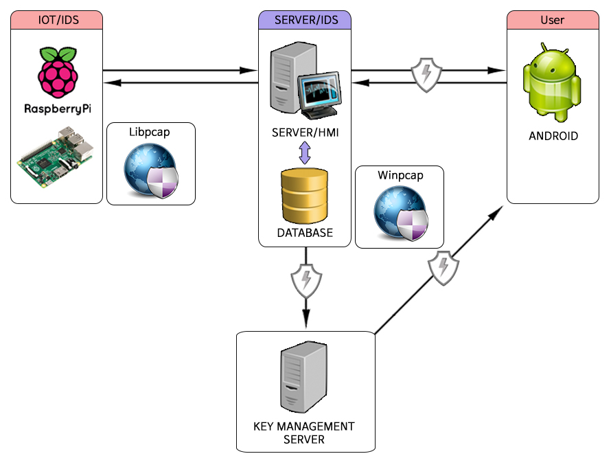

# 본 프로젝트는 라즈베리파이를 이용한 사물인터넷 보안 테스트 플랫폼으로 계속 수정중에 있습니다.


## 프로젝트소개 
본 프로젝트는 사물인터넷의 보안테스트 플랫폼으로 라즈베리파이 - 윈도우서버 - 안드로이드 애플리케이션간 TCP/IP 소켓통신 형태로 구성되며 AES 암호화 플랫폼과 IDS + AES 암호화 풀랫폼을 제공합니다.
### AES 플랫폼
TCP/IP 소켓통신간 데이터와 데이터베이스의 이동간에 AES암/복호화를 적용하고 암호키 관리는 키 관리 서버에 RSA 암호화를 적용해 저장합니다.
<br>


### IDS + AES 플랫폼
특정구간(IoT - 윈도우서버)에 Win/Libpcap을 이용하여 침입탐지 시스템(IDS)을 구성해 중간자 공격 등의 공격시 사용자가 감지할 수 있습니다. AES 구간은 AES 플랫폼과 같은 방식으로 적용됩니다.
<br>


## 설치/실행환경 
TCP/IP 소켓통신은 무선인터넷환경에서 진행되었습니다.
본 프로젝트의 데이터베이스는 Mysql을 사용하였기때문에 다른 데이터베이스 가이드는 제공하지않습니다.
### 라즈베리파이 
* 본 테스트플랫폼에서는 라즈베리파이 3 Model B V1.2를 사용합니다.
	* 하위 버전의 라즈베리파이2,B+ 버전 사용시 무선랜설정을 따로 진행하셔야 합니다.
* [라즈베리파이 하드웨어 구성](https://www.raspberrypi.org/learning/hardware-guide/equipment/)
  * 라즈베리파이 하드웨어 구성은 위 링크를 참조하시기 바랍니다.
* [라즈비안 설치 방법](https://www.raspberrypi.org/learning/software-guide/quickstart/)
  * 라즈비안 설치 방법은 위 링크를 참조하시기 바랍니다.
  * 라즈비안은 [Raspbian-jessie 버전](https://www.raspberrypi.org/downloads/raspbian/)을 사용하였습니다.
* 사용된 코드는 c언어로 작성되었습니다.
* 통신시 전송하는 데이터는 임의로 사용하였습니다.

#### 라즈베리파이 초기 설정
* 라즈베리파이3 기준의 초기 설정입니다.
* 라즈비안 부팅후 터미널을 실행 하여 다음 명령어를 입력합니다. 
	```  
	sudo raspi-config
	```  
	* 7번 Advanced Option으로 들어가서 A1 Expand Filesystem 실행 합니다. 이는 사용자가 라즈비안을 설치한 저장소 전체를 사용할 수 있도록 해줍니다. 
	* 4번 Localisation Options으로 들어가서 T1~4의 과정을 진행 합니다.
		* T1 Change Locale은 언어 세팅 입니다. 다음의 언어팩을 찾아 추가 해주시기 바랍니다.
		```
		en_US.UTF-8  
		ko_KR.UTF-8
		```
		* T2 Change Timezone은 시간 설정입니다. Asia-Seoul로 맟춰 줍니다.(외국의 경우 거주하는 국가에 맟춰 설정하시면 됩니다.)
		* T3 Change Keyboard Layout은 키보드 설정입니다. 기본적인 특수문자 입력을 위해 설정합니다. Generic 105-key (Intl) PC 내에서 Korean-Korean(101/104key compatible)을 추천합니다. (외국의 경우 국가의 키보드 세팅에 맟춰 설정하시면 됩니다.)
		* T4 Chage Wi-Fi Country는 와이파이 설정입니다. KR설정시 와이파이 ARP를 찾지 못하는 현상이 있습니다. US로 설정하시어 무선랜을 사용하시는것을 추천합니다. 
	* 해당 진행 완료후 재부팅 합니다.
* 재부팅 하여 와이파이 연결 후 필수 패키지 업데이트를 위해 터미널에서 다음 명령어를 실행합니다. 
	```
	sudo apt-get update && sudo apt-get upgrade
	```

* 라즈베리파이 MySQL client 설치
	* AES 버전 사용 시 라즈베리파이에서 키관리 서버로 키 데이터를 전송하기 위해 다음과 같은 작업이 필요합니다.
		```
		sudo apt-get install mysql-client && apt-get install libmysql++-dev
		```
	* 다운로드가 완료되면 재부팅 후 정상적으로 mysql과 라이브러리 사용이 가능합니다. 

* 이더넷&무선랜 고정IP사용시
	* 고정 IP사용할시 다음의 추가작업이 필요합니다.
	```
	sudo nano /etc/network/interfaces
	```	
	
			
			유선랜 iP고정시 다음과 같이 설정이 필요합니다. 
			auto eth0
			iface eth0 inet static
			address [고정ip]
			network [xxx.xxx.xxx.0]
			netmask [255.255.255.0]
			gateway [xxx.xxx.xxx.1]
			broadcast [사용하는 dns서버 주소]  
			무선랜 ip고정시 다음과 같이 설정이 필요합니다.
			auto wlan0
			iface wlan0 inet manual
			address [고정ip]
			network [xxx.xxx.xxx.0]
			netmask [255.255.255.0]
			gateway [xxx.xxx.xxx.1]
			broadcast [사용하는 dns서버 주소]
	

	* 위와 같이 작성 후 다음 파일을 편집합니다.
		```
		sudo nano /etc/resolv.conf
		```

			//Generated by resolvconf
			nameserver 사용하는 dns서버 주소
			nameserver 사용하는 dns서버 주소

	* 재부팅 후 ifconfig 명령어로 고정ip 상태를 확인합니다.
* 라즈베리파이 라이브러리 추가 방법
	* AES 버전 실행 시 터미널을 실행하여 다음의 경로에 본 플랫폼에서 제공하는 AES디렉토리와 RSA디렉토리를 추가합니다. 
	```
	cp -r /home/pi/AES /usr/include
	cp -r /home/pi/RSA /usr/include
	```
	* 해당 명령어 입력시 include폴더에 AES폴더와 RSA폴더가 복사되며 TestClient.c에서 AES 및 RSA헤더를 사용할 수 있습니다.

	


### 윈도우서버 
* 윈도우 서버
  * 윈도우 운영체제는 Windows 7 Ultimate K 버전을 사용하였습니다.
  * 윈도우서버는 Visual Studio professional 2015 에서 작성되었으며 mfc로 구현되었습니다.
* 윈도우 서버 라이브러리 추가 
	* Visual Studio 사용시 시스템에 사용된 라이브러리의 경로가 다를 수 있기 때문에 다음과 같은 작업이 필요합니다.
		* Project-> Properties로 들어가 C/C++탭으로 이동합니다.
		* Additional_Include_Directories에 사용할 Include 디렉터리 경로를 추가해 줍니다.
			* ex)C:\Users\WONCHEOL\Downloads\mysql-5.7.19-win32\include
		* Linkek-> Input 탭으로 이동합니다.
		* Additional_Dependencies에 사용할 추가 종속성 파일들을 추가합니다.
			* ex)libmysql.lib
* MySQL
  * 데이터베이스는 MySQL를 사용합니다.
  * [MySQL 설치](https://dev.mysql.com/downloads/windows/installer/5.7.html) 
	  *	MySQL은 다음 링크에서 설치가 가능합니다. 
	  *	프로젝트는 mysql-installer-community-5.7.19.0.msi를 사용하여 설치하였습니다. 
	  * 설치파일 실행 후 Developer Default로 설치 진행합니다.
	  * 설치 경로 설정 후 설치를 시작합니다. 
  * 데이터베이스 외부접속 허용 방화벽설정
    * 제어판 - 시스템 및 보안 - Windows 방화벽 - 고급설정으로 들어갑니다.
    * 인바운드 규칙에서 새규칙을 추가합니다.
    * 포트를 클릭 후 다음버튼을 누릅니다.
    * TCP 클릭 후, 특정포트에 3306 포트를 입력한 후 다음버튼을 누릅니다.
    * 연결허용 후 다음, 이름을 설정 후 마침버튼을 누르면 완료 됩니다.
  * 설치완료 후 데이터베이스 및 테이블 생성
	  *  본 테스트 플랫폼은 아래와 같이 생성하시면 됩니다.
      ```
      create database issi;
      use issi;  
      create table data(  
      data1 varchar(8192) not null,
      date varchar(20) not null);
      ```
    * 사용자환경에 따라 데이터베이스 구성을 바꿔서 사용하시면 됩니다. 
* Apache
  * Apache는 php를 사용하기 위해 설치하므로 apmsetup을 이용해 Apache, php, Mysql을 한번에 설치하셔도 됩니다.
  * 단, 본 프로젝트는 Apache2.4 버전과 php7.1 버전을 따로 설치하였습니다.
  * [Apache 설치](https://www.apachelounge.com/download/)
	* Apache는 [C++ Redistributable Visual Studio 2015](https://www.microsoft.com/ko-kr/download/details.aspx?id=53840) 설치를 선행요구합니다.
	* Apache를 다운받은 후 Apache24 폴더만 C드라이브에 압축을 풀어줍니다.
	* Apache24\conf 폴더에 httpd.conf 파일을 수정해야 합니다.
	* ServerName www.example.com:80 을 찾아 #을 제거후 localhost:80으로 변경 후 저장합니다.
	* 명령프롬프트를 관리자 권한으로 실행합니다.
	* httpd -k install 입력후 아파치 서비스를 설치합니다.
	* httpd -k start 입력후 아파치 서비스를 시작해 줍니다.
	* 인터넷 창을 통해 localhost에 접속하면 Apache24\htdocs의 index.html 파일이 실행됩니다.(아파치 구동 성공)
	* 윈도우나 사용자 환경이 다를 시 사용자 환경에 맞는 설정이 필요합니다.
  * [php7.1 설치](http://windows.php.net/download/)
	* 해당 링크에 접속하여 php 버전 선택 후 Thread Safe를 다운로드합니다.
	* Apache를 설치 했던 C드라이브에 압축을 풀어줍니다.
	* 폴더명은 php71로 변경하였습니다.
	* php 폴더에 php.ini이 없습니다. php.ini-development.ini 를 php.ini로 파일명을 변경해줍니다.
	* 파일명 변경 후 php.ini를 열어 extension_dir 경로를 C:\php71\ext로 변경 후 저장합니다.
	* 명령프롬프트를 관리자 권한으로 실행합니다.
	* httpd -k restart 로 Apache를 재실행합니다.
	* Apache24\htdocs에 phpinfo.php 를 만든 후 <?php phpinfo(); ?>와 같이 작성 후 저장합니다.
	* 인터넷 창을 통해 localhost/phpinfo.php 에 접속하여 php 정보가 나온다면 설치가 완료된것 입니다.
	* 윈도우나 사용자 환경이 다를 시 사용자 환경에 맞는 설정이 필요합니다.


### 안드로이드 
* 안드로이드는 Android Studio에서 작성되었습니다.
* [Android Studio 설치](https://developer.android.com/studio/index.html)
  * 설치는 위 링크에서 가능합니다.
  * 안드로이드 설치시 JAVA설치와 JDK 환경설정이 선행 되어야 합니다.([JAVA설치 링크](http://www.oracle.com/technetwork/java/javase/downloads/index.html))
	  * JDK환경 설정 시 제어판\시스템 및 보안\시스템->고급 시스템 설정으로 이동합니다.
	  * 고급 탭으로 이동하여 환경변수를 지정해 줍니다 .
	  * 시스템 변수에서 새로 만들기로 변수이름과 C:\Program Files\Java\ 에 설치된 JDK 폴더의 경로를 지정해 줍니다.
	  * 시스템 변수에서 Path변수를 편집하여 %변수이름%\bin; 을 추가로 작성한후 저장하면 JDK 환경설정이 완료 됩니다.
* 안드로이드 킷캣 4.4.2 버전에서 구현하였습니다. 하위버전의 안드로이드에서 오류가 발생할수 있습니다. 

* 안드로이드 APK파일 생성방법
	* 안드로이드 스튜디오 내 툴을 이용하여 apk를 업데이트 할수 있습니다.

	* Build - Generate Signed APK 클릭합니다.

	* Generate Signed APK Wizard에서 apk업데이트를 위한 키를 설정할수 있습니다.
키는 제공되는 Android_KEY.jks를 사용하실수 있습니다.

	* 새로 키를 사용하시려면 다음과 같은 작업이 필요합니다
	
```

	Create new 클릭합니다.
	Key store path에 저장할 키파일의 위치와 jks파일 이름을 지정합니다.
	password에는 Key store path에 대한 비밀번호를 입력합니다. 6자리 이상의 비밀번호를 입력해야하며 암호를 잊어버리면 키를 사용하실수 없습니다.

	Key-Alias에는 키이름을 작성합니다 이후 키 비밀번호도 입력합니다. 키 비밀번호 역시 6자리 이상의 비밀번호를 입력해야 하며 암호를 잊어버리면 키를 사용하실수 없습니다.

	Certificate에는 키에대한 정보를 입력합니다. Country Code에는 ko 를 입력한후 다음으로 넘어갑니다.

	Next 클릭후 apk가 위치할 폴더를 설정합니다. Build타입은 debug,release선택이 가능합니다. 배포를 위해서 release로 설정후 마칩니다.

	apk생성이 완료되면 우측상단에 show in exploer 메시지가 생성됩니다. 클릭시 apk파일이 생성되는것을 확인하실수 있습니다. 
	
```


###  IDS 
* IDS는 윈도우 서버와 라즈베리파이에 위치하여 시스템 내 통신패킷을 캡쳐하여 시스템 의 오류 및 비정상 행위를 탐지합니다. 
	* Winpcap
		* Winpcap은 윈도우 OS 에서 pcap을 사용할 수 있게 하는 라이브러리 입니다.
		* 라이브러리는 [다운로드](https://www.winpcap.org/install/default.htm)를 통해 받을수 있습니다.  
		* 프로젝트에서 사용하는 버전은 4.1.3 버전을 사용합니다.
		* 윈도우 서버에서 사용하기위해 앞서 Mysql 라이브러리 추가 방법과 같이 다운로드 받은 라이브러리의 경로를 추가해줍니다.

	* Libpcap
		* Libpcap은 리눅스,유닉스 계열 OS 에서 pcap을 사용할수 있게 하는 라이브러리 입니다. 
		* IDS 버전 사용 시 라즈베리파이에서 pcap을 사용할수 있도록 터미널에서 다음 명령어를 입력하여 라이브러리를 설치합니다. 
		```
		sudo apt-get install libpcap-dev
		``` 
		* 정상적으로 설치가 진행 되면 pcap라이브러리를 사용하실 수 있습니다.
		
 
### 키관리서버 
* 키관리서버는 윈도우서버와 독립된 데이터베이스 서버입니다.
* MySQL
  * 설치방법은 [MySQL 설치](https://dev.mysql.com/doc/refman/5.7/en/installing.html)를 참조하시면 됩니다.
  * 외부접속 허용 방법은 윈도우서버 MySQL을 참조하세요.
  * 설치완료 후 데이터베이스 및 테이블 생성
    * 본 테스트 플랫폼은 아래와 같이 생성하시면 됩니다.
     ```
     create database issi;
     use issi;
     create table encryptkey(
     aes varchar(100) not null,
     rsa int(1) not null,
     rsa2 int(1) not null,
     rsa3 int(1) not null,
     date varchar(20) not null);
     ```
    * 사용자환경에 따라 데이터베이스 구성을 바꿔서 사용하시면 됩니다.

## 사용방법
설치/실행환경이 구성이 완료되면 플랫폼을 사용하실 수 있습니다.
사용방법은 아래항목을 참조하세요.

### 라즈베리파이
#### 라즈베리파이 실행파일 사용방법
  * 소스코드파일과 실행파일을 라즈베리파이에 다운받습니다.
  * 터미널 실행 후 실행파일이 있는 경로로 이동 후 실행파일을 아래와 같이 실행하시면 됩니다.
    ```
    sudo ./TestClient
    sudo ./TestClient_Encrypt
    ```
  * 소스코드 수정시에는 아래와 같이 실행파일을 재생성 해주어야 합니다.
    ```
    gcc -o TestClient TestClient.c
    gcc -o TestClient_Encrypt TestClient_Encrypt.c -lmysqlclient -I/usr/include/mysql
    ```
  
### 윈도우서버
* 윈도우서버 실행방법
  * 윈도우서버파일을 다운로드하여 디버그폴더의 exe파일을 실행하시면 됩니다.
  * 소스코드수정은 Visual Studio 2015에서 수정할 수 있습니다.
  * 소스코드수정시 MySQL 라이브러리 추가작업이 필요합니다.
  * 이 외의 버전에서도 수정이 가능하나 사용자환경에 맞는 설정변경이 필요합니다.
  
### 안드로이드
* 안드로이드 애플리케이션 실행방법
  * 자신의 안드로이드로 apk파일을 다운로드하여 실행하시면 됩니다. 
  * 소스코드수정은 Android Studio에서 수정할 수 있습니다.
  
### IDS
* 라즈베리파이 IDS 실행방법
	* 라즈베리파이 소스코드 파일과 실행파일을 라즈베리파이에 다운받습니다.
	* 터미널 실행후 실행파일이 있는 경로에서 다음 명령어로 실행파일을 구동합니다.
	```
	sudo ./pcap
	```
	* 소스코드 수정후 컴파일 시 다음의 명령어가 필요합니다.
	```
	gcc -o pcap pcap.c -lpcap
	```
* 윈도우서버 IDS 실행방법
	* TestServer(IDS) 버전 디버그 파일을 실행하시면 다이얼로그내 버튼으로 지원됩니다.

### 키관리서버
* 키관리서버의 경우 해당 서버 PC의 Mysql을 실행해주시면 됩니다.

## 보안성 검증을 위한 시스템 공격 시나리오

### 중간자공격 실험(Man-In-The-Middle_Attack)

#### 중간자 공격 실험 준비
* 동작중인 AES플랫폼과 같은 네트워크에 있는 공격자 PC가 필요합니다. 본 실험에서는 Ubuntu 16.04 LTS를 사용합니다.
* 공격자 PC에는 wireshark와 ettercap이 설치되어있는 환경이어야 합니다. 설치되있지 않은 경우 관리자권한의 터미널을 실행 후 다음의 명령어로 설치바랍니다.
```
apt-get install wireshark
apt-get install ettercap-graphical
```

#### AES버전 공격실험
* wireshark를 실행하여 AES플랫폼이 사용하고 있는 랜카드를 스캔합니다
* 다음의 필터를 입력하여 AES플랫폼의 통신패킷을 확인하도록 설정합니다.
```
tcp.port == 7777
``` 
* ettercap을 실행하여 AES플랫폼이 사용하고 있는 랜카드를 스니핑합니다.
* host스캔으로 서버와 IOT영역의 IP를 타겟으로 지정합니다.
* MITM탭에서 ARP스푸핑을 시작합니다.
* wireshrak를 통해 패킷스캔이 되는것을 확인합니다.
	* 패킷스캔은 가능하지만 데이터 페이로드는 확인이 불가능한것을 확인할수 있습니다.
#### AES+IDS버전 공격실험
* AES+IDS플랫폼을 동작시킵니다.
* IOT와 서버의 IDS를 실행후 AES공격실험과 동일하게 진행합니다. 
* 데이터 페이로드가 정상적으로 분석되는것을 확인하고 해당 데이터를 변조하는 실험을 시작합니다.
* etterfilter파일을 작성하여 컴파일합니다.[etterfilter 작성 방법](http://www.irongeek.com/i.php?page=backtrack-3-man/etterfilter)
```
etterfilter -o Payload.elf Payload.el
```
* ettercap의 filter탭하여 컴파일한 필터를 실행합니다.
*  서버와 IOT의 IDS를 실행하여 패킷 변조상태를 비교합니다.
	*  IOT의 IDS에서는 정상적으로 패킷이 나갔기때문에 검출하지 않지만 서버의 IDS는 공격자를 거친 패킷을 수신받기 때문에 IDS내에서 비정상행위를 탐지하는것을 확인할수 있습니다
	*  두 IDS를 비교하여 현재 중간자 공격이 있고 패킷이 변조되었음을 확인할수 있습니다.


### DDOS공격 실험(Distributed-DoS_Attack)

#### DDOS 공격실험 준비
* 동작중인 AES+IDS버전과 같은 네트워크에 있는 공격자 PC가 필요합니다. 본 실험에서는 Ubuntu 16.04 LTS를 사용합니다.
* 공격자 PC에는 hing3가 설치되어 있는 환경이어야 합니다. 설치되있지 않은 경우 관리자권한의 터미널을 실행 후 다음의 명령어로 설치바랍니다
```
apt-get install hping3
```
#### AES+IDS버전 공격실험
* 공격자 PC에서 다음의 명령어로 hping3를 실행합니다.
```
hping3 [공격대상 IP] -S --flood -p 8000
```
* 명령어 입력시 공격자 PC는 타겟의 port에게 무작위IP로 SYN패킷을 전송하게 됩니다.
* IOT와 서버의 IDS에서 DDOS공격을 탐지하는지 확인합니다.
	* IOT 및  서버를 타겟으로 DDOS공격시 각영역에서 작동하는 IDS는 과도하게 수신되는 SYN패킷을 감지하여 DDOS경고를 알립니다.
-------
